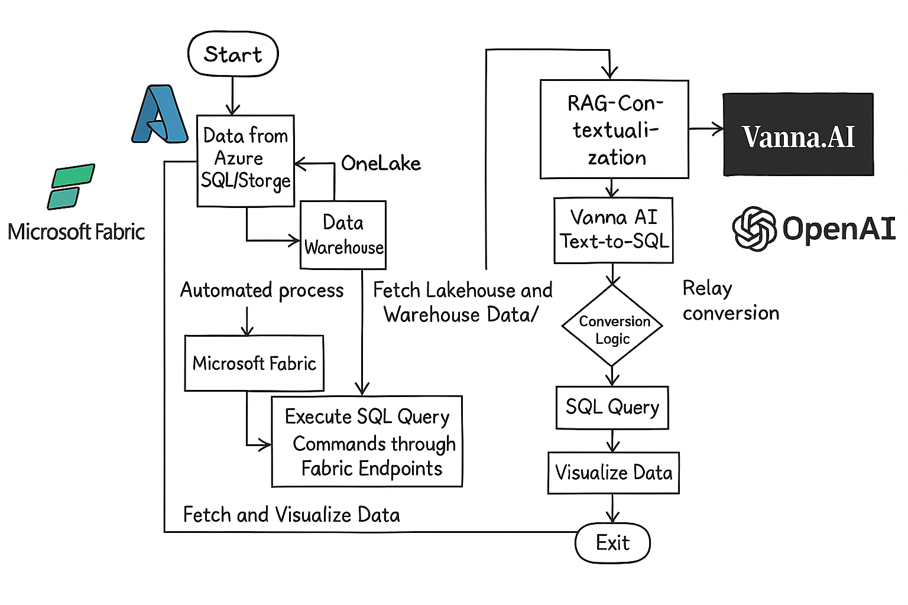

# 💼 Microsoft Fabric Financial Reporting Agent

**Empowering wealth management with AI-powered, natural language financial insights.**

This project consolidates wealth data into Microsoft Fabric's OneLake and provides a powerful interface using Vanna AI + GPT-4 to convert natural language queries into SQL. It enables real-time analysis of client portfolios, asset distributions, and transactions via an interactive dashboard and RAG-based querying system.

## 📊 Architecture Overview

  

## 🚀 Features

- 🔍 **Natural Language to SQL** with Vanna AI + OpenAI
- 📈 **Real-time Dashboard Visualizations**
- 🧠 **Retrieval-Augmented Generation (RAG)** for contextual accuracy
- 🗂️ **Scalable Storage** using Microsoft Fabric OneLake
- 🧩 **LangChain Integration** for multi-step queries and context chaining

## 🏗 Project Structure

```plaintext
├─ CreateDataWarehouse/         → SQL table + view creation and data insertion
├─ LangchainFabrics/            → LangChain-powered query interface
├─ RAGToSQL/                    → RAG setup, training, inference scripts
├─ requirements.txt             → Python dependencies
└─ Readme.md                    → This file
```

## 📦 Tech Stack

| Component          | Tool/Platform                  |
|-------------------|--------------------------------|
| Cloud Platform     | Microsoft Fabric + Azure       |
| Data Storage       | OneLake (Lakehouse + Warehouse)|
| AI Models          | GPT-4, Vanna AI                |
| Orchestration      | Python 3.10, LangChain         |
| Dashboard          | Vanna Dashboard + Fabric       |

## ⚙️ Setup Instructions

### 🧰 Prerequisites

- Python 3.9+
- Microsoft Fabric access (OneLake & Data Warehouse enabled)
- Required libraries:
  ```bash
  pip install -r requirements.txt
  ```

### 🛠️ Steps

1. **Set up Microsoft Fabric Lakehouse** and schema using `CreateDataWarehouse` scripts.
2. **Insert dummy data** (~1GB) via:
   ```bash
   python CreateDataWarehouse/insertToSQL.py
   ```
3. **Train the RAG model**:
   ```bash
   python RAGToSQL/TrainRAG.py
   ```
4. **Run inference**:
   ```bash
   python RAGToSQL/InferenceRAG.py
   ```

## 🧠 AI Capabilities

- Convert questions like:
  - “What’s the total portfolio value for client X?”
  - “List top 5 asset classes by value.”
- Into precise SQL queries executed against your Fabric data warehouse.

- Powered by:
  - 🔄 **Vanna AI** for text-to-SQL
  - 💬 **LangChain** for conversational memory and multi-turn Q&A
  - 🧠 **RAG architecture** for contextual response generation

## 📬 Contact

For contributions, questions, or collaborations, feel free to open a [GitHub Issue](https://github.com/your-repo/issues) or connect with the team.

